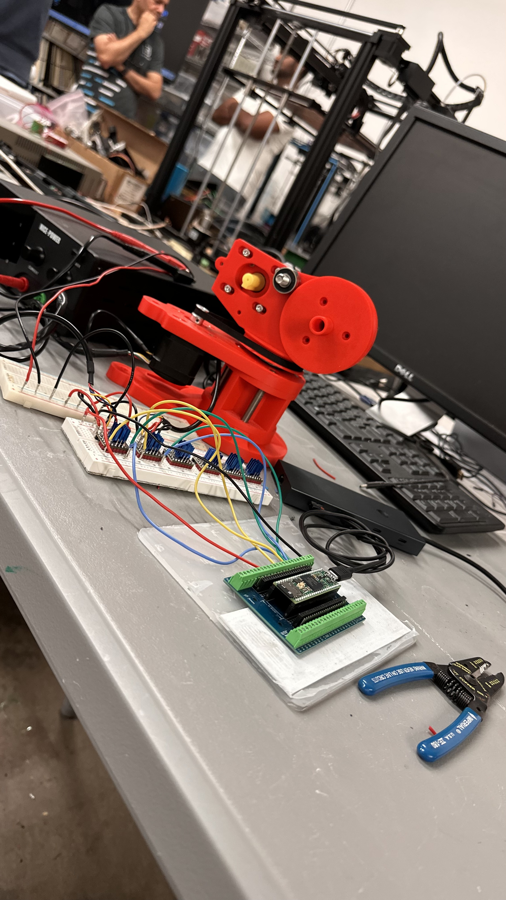
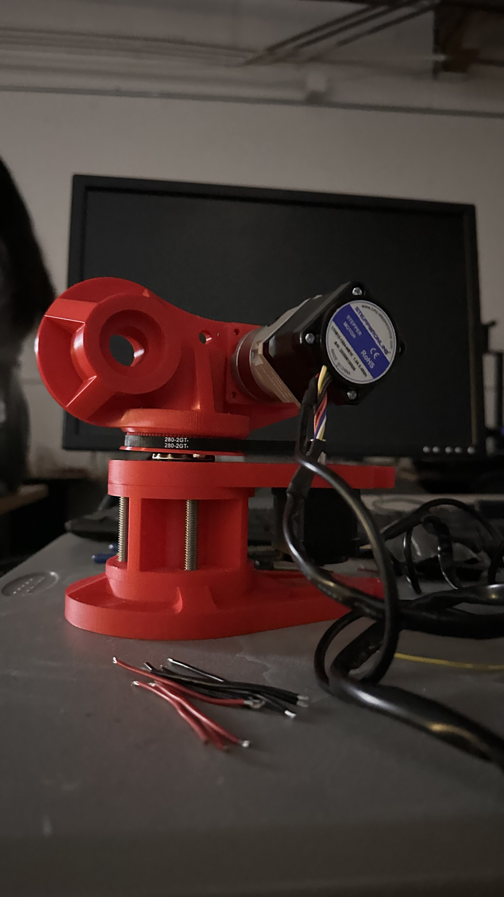
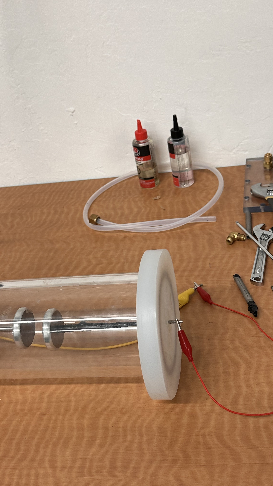

# 6-axis Robotic arm with embedded control using Raspberry Pi 5 and Teensy 4.1 for safe application of Cold Atmospheric Plasma

Cold Atmospheric Plasma (CAP) has been known to accelerate wound healing process and sterilize the wound surface, however safe application requires precise control over the application parameters which is not possible when done manually by a clinician. Thus, there is a need for a robotic system which can precisely deliver CAP on complex wound geometries while guaranteeing patient safety. I prospose the designing, fabrication,and validation of a 6-axis open source arm which is optimized for clinical safety. Designs have been made in fusion360 and the first two axis have been 3D printed using reinforced PLA. High resolution closed-loop NEMA 17 motors along with necessary backlash-control gearboxes for precise control while also eliminating the need for brakes. Software is separated into two sections, the Teensy 4.1 microcontroller handles low-level movement, redundancy checking with the motor's inbuilt encoders, and other necessary processes. The raspberry pi 5 will run MATLAB and LinuxCNC and will manage high-level trajectory motion planning, Jacobin inverse kinematics, and provide a GUI for the system. This system will also manage parameters for plasma application. I believe this low-cost arm provides a foundation for plasma robotics in outpatient plasma therapy and adaptable industrial surface-treatment tasks. Future work would include increasing the robot's rigidity and end-effector work volume as well as looking into computer-vision for wound detection.


## Features

- **6-Axis Control**: Full 6DOF manipulation capabilities.
- **Closed-Loop System**: Real-time position tracking and error correction using magnetic encoders.
- **Advanced Motion Control**: 
    - Smooth acceleration/deceleration profiles.
    - Synchronized multi-axis movement.
    - Homing and calibration routines.
- **Firmware**:
    - Built for Teensy 4.x / Arduino.
    - **TMC2209 Drivers**: UART control for current setting, microstepping, and diagnostics (StealthChop/SpreadCycle).
    - **Atomic Operations**: Thread-safe variable access for reliable interrupt-based encoder counting.
- **Hardware**: Custom PCB designs for signal routing and driver management.

## Hardware

The project includes custom PCB schematics located in the `pcb schematics` directory. These files include designs for the main controller board and driver interfaces, created in KiCad.

## Firmware Highlights

The core firmware is located in the `test code` directory. The system uses atomic operations to ensure data integrity between high-frequency interrupts and the main loop.

### Atomic Access Macros
Ensures safe reading of volatile encoder data during active motion.
```cpp
#define ATOMIC_BLOCK_START noInterrupts()
#define ATOMIC_BLOCK_END interrupts()

#define ATOMIC_READ(var) ({ \
  ATOMIC_BLOCK_START; \
  auto tmp = var; \
  ATOMIC_BLOCK_END; \
  tmp; \
})
```

### Encoder Verification
The system can self-diagnose direction mismatches between the motor and encoder.
```cpp
// NEW: Verify encoder counts in same direction as motor
void verifyEncoderDirection(uint8_t axis) {
  SERIAL_DEBUG.println("\n=== VERIFYING ENCODER DIRECTION ===");

  enableAxis(axis, true);
  delay(100);

  long startEnc = ATOMIC_READ(axes[axis].encoderCount);

  // Move in positive direction
  digitalWrite(axes[axis].dirPin, HIGH);
  for (int i = 0; i < 800; i++) {  // Quarter revolution
    digitalWrite(axes[axis].stepPin, HIGH);
    delayMicroseconds(STEP_PULSE_WIDTH);
    digitalWrite(axes[axis].stepPin, LOW);
    delayMicroseconds(1000);
  }
  // ... verification logic ...
}
```

## Gallery

### Assembled Arm


### Electronics & Testing

